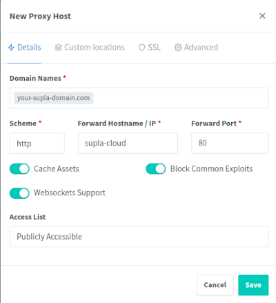
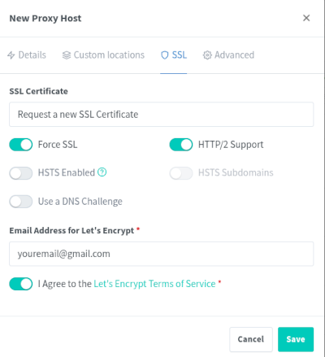

# SUPLA-Docker

[](https://hub.docker.com/r/supla/supla-cloud/)
[](https://github.com/SUPLA/supla-docker/releases/latest)

Your home connected. With Docker. www.supla.org


[//]: # (## Installation &#40;video&#41;)

[//]: # ([![SUPLA Installation Video]&#40;https://img.youtube.com/vi/MBgRUE_5dFU/0.jpg&#41;]&#40;https://www.youtube.com/watch?v=MBgRUE_5dFU&#41;)

## Installation

1. Install [Docker CE](https://docs.docker.com/engine/installation/) 24+ with `docker-compose-plugin` and Git.
1. Clone this repository.
   ```
   git clone https://github.com/SUPLA/supla-docker.git
   ```
1. Generate sample config by running
   ```
   ./supla-docker/supla.sh
   ```
   Review the settings in `./supla-docker/.env` file.
1. Start SUPLA!
   ```
   ./supla-docker/supla.sh start
   ```
   
## Creating a user account

Create a new user account from the command line.

```
./supla-docker/supla.sh create-confirmed-user
```

## Upgrading to the newest version
```
cd supla-docker
git pull
./supla.sh upgrade
```

## Launching in proxy mode

You should run the SUPLA containers in proxy mode if

 * already have another dockerized application running on ports 80 or 443 or
 * do not own a valid SSL certificate for your domain but still want your cloud instance to be accepted by the browsers.
 
Here's how.

1. Stop SUPLA if it's running with `./supla.sh stop`.
1. Install [Nginx Proxy Manager](https://nginxproxymanager.com/guide/#quick-setup)
   and [configure it with a network](https://nginxproxymanager.com/advanced-config/#best-practice-use-a-docker-network) 
   with name `webproxy`;
1. In the file `supla-docker/.env` find the following configuration
    ```
    COMPOSE_FILE=docker-compose.yml:docker-compose.standalone.yml
    ``` 
    and change it to 
    ```
    COMPOSE_FILE=docker-compose.yml:docker-compose.proxy.yml
    ```
1. Start SUPLA.
   ```
   ./supla-docker/supla.sh start
   ```
1. Enter the Nginx Proxy Manager UI and configure a Virtual Host. Use images below as a reference.




## FAQ

### It does not work! What to do?

Check logs first.

```
docker logs --since=5m supla-cloud
docker logs --since=5m supla-server
docker logs --since=5m supla-db
```

Moreover, if you are running in the proxy mode, you might also be interested in logs from the [proxy containers](https://github.com/evertramos/docker-compose-letsencrypt-nginx-proxy-companion/blob/master/.env.sample#L12-L14).

### Cannot start service supla-cloud: driver failed programming external connectivity on endpoint supla-cloud (***): Error starting userland proxy: listen tcp 0.0.0.0:443: bind: address already in use

It means that you have another application running on the port 80 or 443. You can either
* turn it off and try to launch SUPLA again or
* change the ports that supla-cloud container listens on in the .env file or
* try to run them both with proxy configuration described above.

### How to configure custom SSL certificate?

After the first launch, a self-signed certificate will be generated for you to make sure everything works. However,
web browser will complain when using such certificate so it's good idea to further configure your instance.
If you have your own SSL certificate, put it in `server.key` and `server.crt` files inside `ssl/cloud` directory
and restart the application.

If your SSL certificate consists of a chainfile (i.e. there is another certificate file besides the `.crt` and `.key` files):

1. Make a copy of original certificate files.
1. Prepare one-file certificate by concatenating the certificate file and the chain (in this order!)
    ```
    cat server_original.crt rootca_chain.crt > server.crt
    ```
1. Store the resulting `server.crt` in `ssl/cloud`.
1. Restart the application.
